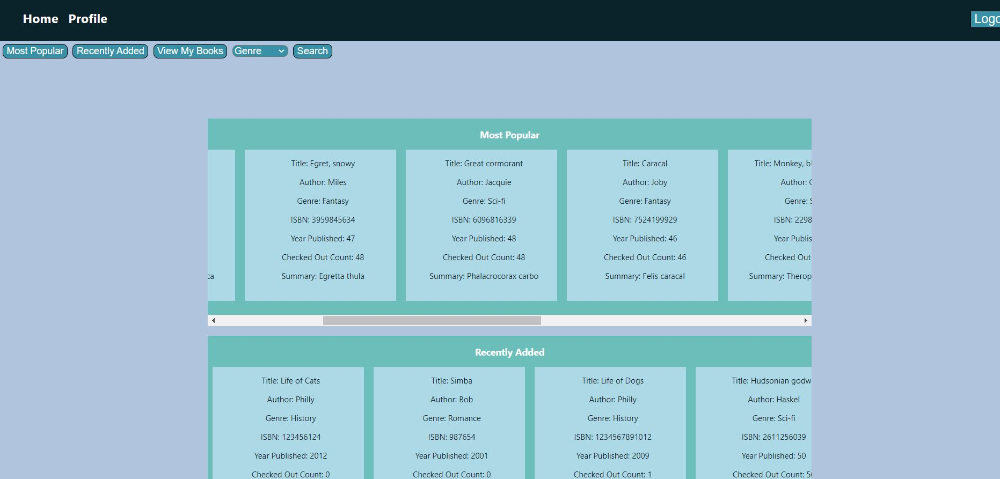

# Virtual Public Library

## Project Description

The Virtual Public Library will manage the process of checking out e-books. All users can register an account, login, and search for books based on a variety of filters. Users can then checkout any book of their choice and will receive a confirmation email. An owner will be able to login and will have the ability to add/remove e-books from the library’s inventory.

## Technologies Used

- React
- Typescript
- CSS
- Spring Boot
- Hibernate ORM
- JUnit
- Java 8
- Gradle
- Log4j
- PostgrSQL
- AWS EC2, S3, RDS
- Git

## Features

### Regular Users

- Register new account
- Login/logout
- View homepage
- View/edit user's information
- Checkout books
- View list of previously checked out books
- Search books by title, author, genre, ISBN, etc.

### Managers/Owners

- Login/Logout
- Add new books
- Delete books by ISBN
- Edit uploaded books' info
- View all registered users' information

## Getting Started

Create a gitbash terminal in the directory where you want to store the repository and run the following commands:

```
git clone
cd ./virtual-public-library/vpl-frontend/vpl-frontend
npm install
```

To start the application, run `npm start`.

## Usage

### Logging In/Registering

Upon starting the application, the user will be taken to the login page. To login, simply enter the correct credentials into to form.


To register a user, click the "Register" button; the user will be redirected to the registration page. Enter the user's information into the appropriate fields.


### Homepage

Upon logging in, the user will be redirected to the homepage. Here, the user can view the library's most popular books, recently added books, and their own checked out books.



### Using the Navigation Bar

The user can use the navigation bar to view the most popular books, recently added books, their checked out books, search books by genre, and search books by keyword.


### Checking Out a Book

After searching for a book using the navigation bar, a user can check out a book by clicking the "Checkout" button at the bottom of the book card.


## Contributors

- Hailey "Yue" McNelis ([yuemcn](https://github.com/yuemcn))
- Joseph Link ([jj-link](https://github.com/jj-link))
- Chime Palden ([chimepalden](https://github.com/chimepalden))
- Darryl Robles ([S1m1ster](https://github.com/S1m1ster))
- Bok-Man "Victor" Siu ([victorbsm](https://github.com/victorsbm))
